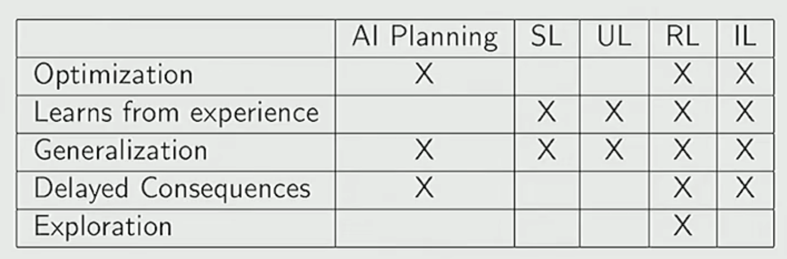
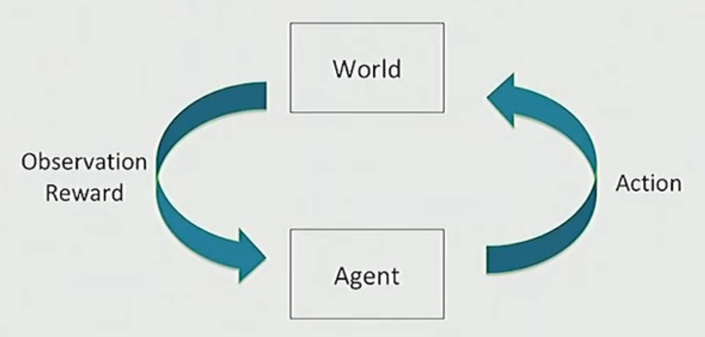

# **Introduction to Reinforcement Learning**

## 1 What is RL?

### 1.1 RL Generally Invoves

* Optimization(优化): 做出决策的最优方式。(指强化学习中的效用函数)
* Delayed consequences(延迟后果): 现在做出的决策可以对未来造成深远影响。
**[chanllenges]**
  * 计划阶段：决策不仅要考虑决策的眼前利益, 还要考虑决策的长远影响。
  * 学习阶段： 时间信用的分配是困难的。
* Exploration(探索): 通过决策行为建模。
* Generalization(泛化)

### 1.2 RL compares with other methods

### 1.3 Two Problem Categories Where RL is articularly Powerful

* 不存在期望行为实例的问题。
* 含有延迟后果的大规模搜索。(例如AlphaGo)

## 2 Sequential Decision Making and Other Concepts

### 2.1 Sequential Decision Making (顺序决策)

* 一种在一系列时间点上做出决策的过程, 其中每个决策都依赖于之前的选择以及这些选择带来的结果。
* 目的是通过决策行为最大化期望回报(reward)。
* 需要平衡短期和长期的回报。

### 2.2 State Space(状态空间)

所有可能的状态集合。状态表示决策环境中的一个重要快照, 它包含了决策者做决策时所需的所有信息。

### 2.3 Agent(智能体)

* 智能体与环境(Environment)交互, 通过尝试不同的动作(Actions), 观察环境的响应(包括新的状态和奖励/惩罚), 并根据这些反馈调整其行为策略, 以达到最大化累积奖励的目的。

### 2.4 Markov Assumption(马尔可夫假设)

* 一个系统的未来状态仅依赖于当前的状态, 而与过去的历史无关。
$$ P(X_{t+1} = x_{t+1} \mid X_t = x_t, X_{t-1} = x_{t-1}, \ldots, X_0 = x_0) = P(X_{t+1} = x_{t+1} \mid X_t = x_t) $$
* Marcov Assumption的有效性取决于状态建模的质量。
* 实践中假设最近的观测结果是对历史的充分统计。

### 2.5 Markov Process or Markov Chain

是无记忆的随机过程, 是符合马尔可夫性质的随机状态的集合, 可以以状态空间 $S$ 和转移概率矩阵 $P$ 描述：

* 概率转移矩阵: 一个 $n×n$ 的矩阵, 第 $i$ 行第 $j$ 列的元素 $P_{ij}$ 表示从状态 $s_{i}$ 转移至状态 $s_{j}$的概率, 即:
  $$P_{ij} = P(X_{t+1} = s_j \mid X_t = s_i)$$
  或以矩阵形式表示为:
  $$P = \begin{pmatrix}
    P(s_{1}|s_{1}) & P(s_{2}|s_{1}) & \cdots & P(s_{n}|s_{1}) \\
    P(s_{1}|s_{2}) & P(s_{2}|s_{2}) & \cdots & P(s_{n}|s_{2}) \\
    \vdots & \vdots & \ddots & \vdots \\
    P(s_{1}|s_{n}) & P(s_{2}|s_{n}) & \cdots & P(s_{n}|s_{n})
    \end{pmatrix}$$
* 除此之外, 可以使用一个列向量 $v_{t}$ 表示系统在时间 $t$ 的状态分布，其中 $v_{t}(i)$ 表示系统在时间 $t$ 处于状态 $s_{i}$ 的概率:
    $$\mathbf{v}_t = \begin{pmatrix}
    v_t(1) \\
    v_t(2) \\
    \vdots \\
    v_t(n)
    \end{pmatrix}$$

### 2.6 MDP(马尔可夫决策过程) or MRP(马尔可夫奖励过程)

MDP提供了一种形式化的方法来描述智能体与环境之间的互动, 与Marcov Chain不同的一点是包含了对智能体的奖励, 由以下几个部分组成：

* 状态空间 $S$
* 动作空间 $A$: 包含了所有的动作, 对于每个状态, 存在一个可能的动作集$A(s)$, 即在该状态下智能体可以选择的所有动作。
* 转移概率 $P(s' | s, a)$: 描述了从状态 $s$ 执行动作 $a$ 后转移到状态 $s'$ 的概率。
* 奖励函数 $R(s, a)$ 或 $R(s, a, s')$: 定义了智能体执行某个动作后获得的即时奖励。它可以依赖于当前状态 $s$ 和采取的动作 $a$, 也可以进一步依赖于下一个状态 $s'$
* 折扣因子 $\gamma$: 一个介于0和1之间的参数, 用于计算未来奖励折算的当前价值。

MRP是一个与MDP类似的概念, 但是在MRP中, 智能体不能进行自主行动, 而总是转移概率不依赖智能体的决策。MRP的转移概率表示为$P(s' | s)$。

### 2.7 Policy(策略)

* 在MDP框架下, 智能体的目标是寻找一个最佳策略 $π*$, 使得无论从任何状态开始, 使得从任何初始状态开始, 它都能获得最大化的期望累积奖励。策略π是一个映射, 它为每个状态指定了应该采取的动作。
* 策略有两种形式:
  * 确定性策略(Deterministic policy):
$$\pi(s) = a$$
  * 随机性策略(Stochastic policy):
$$\pi(a \mid s) = P(A = a \mid S = s)$$
* 对于一个策略 $\pi$, 定义其价值函数 $V^\pi(s)$ 为从状态 $s$ 开始, 遵循策略 $\pi$, 智能体获得的累积奖励折现的期望。
* 对于一个策略 $\pi$, 定义其动作价值函数(Q function) $Q^\pi(s,a)$ 为在状态 $s$ 采取动作 $a$ 后遵循策略 $\pi$ 时, 智能体获得的累积奖励折现的期望。
  
### 2.8 Horizon(持续时间)

Horizon指智能体与环境交互的时间范围或持续时间, 它决定了智能体考虑的未来奖励的时间长度, 可以是有限或无限的:

* Finite Horizon(有限地平线): 智能体只考虑有限时间补偿之内的奖励最大化, 价值函数和动作价值函数为为:
  $$V^\pi(s) = \mathbb{E}_\pi \left[ \sum_{t=0}^{T-1} \gamma^t R(s_t, a_t) \mid s_0 = s \right]$$
  $$ Q^\pi(s, a) = \mathbb{E}_\pi \left[ \sum_{t=0}^{T-1} \gamma^t R(s_t, a_t) \mid s_0 = s, a_0 = a \right] $$
* Infinite Horizon(无限地平线): 智能体的目标是在无限的时间内最大化期望的累积折扣奖励, 价值函数和动作价值函数为:
  $$V^\pi(s) = \mathbb{E}_\pi \left[ \sum_{t=0}^{\infty} \gamma^t R(s_t, a_t) \mid s_0 = s \right]$$
  $$ Q^\pi(s, a) = \mathbb{E}_\pi \left[ \sum_{t=0}^{\infty} \gamma^t R(s_t, a_t) \mid s_0 = s, a_0 = a \right] $$
